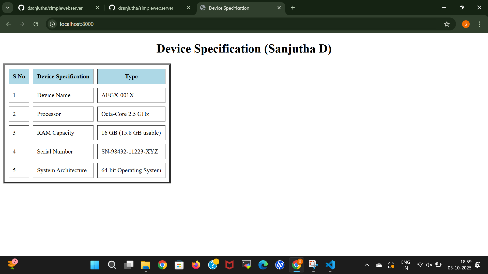
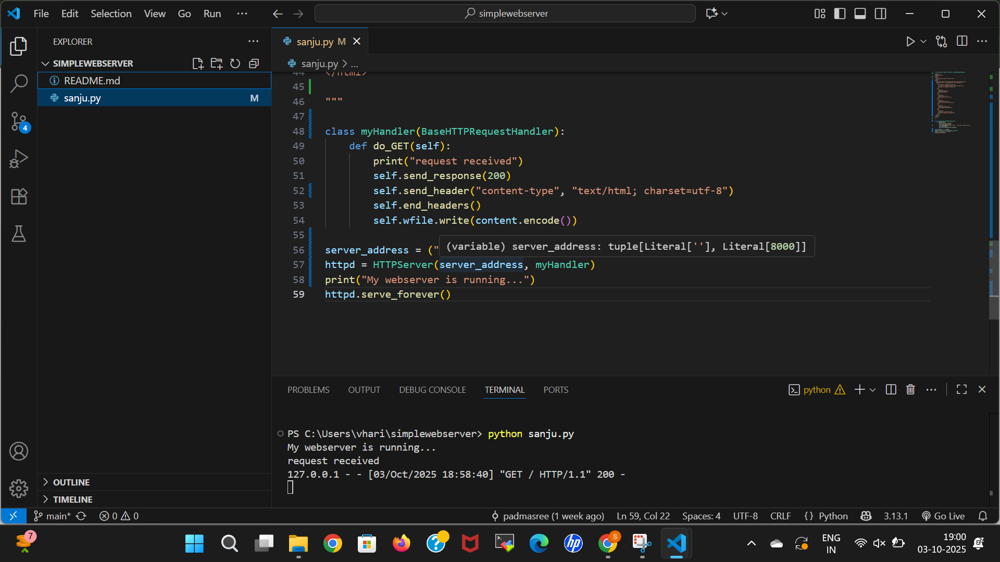

 # EX01 Developing a Simple Webserver
## Date:16.09.25

## AIM:
To develop a simple webserver to serve html pages and display the Device Specifications of your Laptop.

## DESIGN STEPS:
### Step 1: 
HTML content creation.

### Step 2:
Design of webserver workflow.

### Step 3:
Implementation using Python code.

### Step 4:
Import the necessary modules.

### Step 5:
Define a custom request handler.

### Step 6:
Start an HTTP server on a specific port.

### Step 7:
Run the Python script to serve web pages.

### Step 8:
Serve the HTML pages.

### Step 9:
Start the server script and check for errors.

### Step 10:
Open a browser and navigate to http://127.0.0.1:8000 (or the assigned port).

## PROGRAM:
```
from http.server import HTTPServer, BaseHTTPRequestHandler
content = """

<html>
<head>
  <title>Device Specification</title>
</head>
<body>
  <h1 align="center">Device Specification (Sanjutha D)</h1>
  <table border="5" cellpadding="10" cellspacing="10">
    <tr>
      <th bgcolor="lightblue">S.No</th>
      <th bgcolor="lightblue">Device Specification</th>
      <th bgcolor="lightblue">Type</th>
    </tr>
    <tr>
      <td>1</td>
      <td>Device Name</td>
      <td>AEGX-001X</td>
    </tr>
    <tr>
      <td>2</td>
      <td>Processor</td>
      <td>Octa-Core 2.5 GHz</td>
    </tr>
    <tr>
      <td>3</td>
      <td>RAM Capacity</td>
      <td>16 GB (15.8 GB usable)</td>
    </tr>
    <tr>
      <td>4</td>
      <td>Serial Number</td>
      <td>SN-98432-11223-XYZ</td>
    </tr>
    <tr>
      <td>5</td>
      <td>System Architecture</td>
      <td>64-bit Operating System</td>
    </tr>
  </table>
</body>
</html>

"""
class myhandler(BaseHTTPRequestHandler):
    def do_GET(self):
        print("request received")
        self.send_response(200)
        self.send_header('content-type', 'text/html; charset=utf-8')
        self.end_headers()
        self.wfile.write(content.encode())

server_address = ('',8000)
httpd = HTTPServer(server_address,myhandler)
print("my webserver is running...")
httpd.serve_forever()
```


## OUTPUT:







## RESULT:
The program for implementing simple webserver is executed successfully.